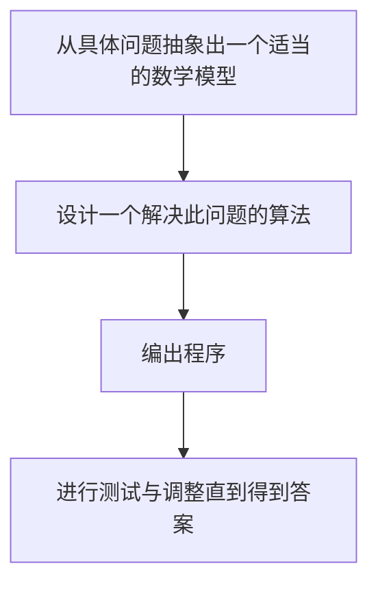
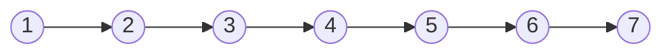

# 数据结构与算法
## 1.引言
### 1.1 什么是数据结构？
——用计算机解决一个问题，通常需要以下几个步骤：     

- 寻求数学模型的实质：分析问题，从中提取操作的对象，并找出这些操作对象之间含有的关系，然后用数学的语言加以描述。  
- 很多问题最后都转化为求解数学方程或数学方程组。
- 但是当计算机进入非数值计算领域，尤其是用在管理上的时候，计算机的操作对象之间的关系就无法用数学方程加以描述。

$$非数值计算问题的数学模型正是数据结构$$
数据结构的讨论一般涉及以下三个方面内容：  
1.数据成员以及它们相互之间的逻辑关系，也成为数据的逻辑结构，简称为**数据结构**。  
2.数据成员及其关系在计算机存储器内的存储表示，也称为数据的物理结构，简称为**存储结构**。  
3.施加于该数据结构上的操作。     

### 1.2 数据结构
#### 1.逻辑结构
- 相互之间存在一种或多种特定关系的数据元素的集合。  
- 四类基本结构：
   - 1.集合
   - 2.线性结构
   - 3.树形结构
   - 4.图结构
 
**数据结构的形式定义**     
数据结构是一个二元组`Data Structure = (K,R)`，其中，$K$是数据元素的有限集，$R$是$K$上关系的有限集。   
例如：`list=(K,R)`     
其中，$K=\{1,2,3,4,5,6,7\},R=\{<1,2>,<2,3>,<3,4>,<4,5>,<5,6>,<6,7>\}$（有序数对）       
图形表示：   

#### 2.物理结构
- 数据逻辑结构在计算机中的表示和实现。
- 包含数据元素的表示和关系的表示。

**数据元素之间关系的表示**    
- 顺序存储结构（地址连续）
   - 结点间的逻辑关系由存储单元的邻接关系来体现。通常顺序存储结构是借助于语言的数组来描述的。
 
- 链式存储结构:位置可以不连续
   - 存储信息更多，占用空间也多了
 
 数据的逻辑结构与存储结构密切相关：
 - 算法设计取决于选定的逻辑结构。  
 - 算法的实现依赖于采用的存储结构。
 
**应用：染色问题**     
可以转化为图论问题。此处略。

### 1.3 算法分析与设计
#### 1.3.1 算法 
是对特定问题求解步骤的一种描述，它是指令的有限序列，其中每一条指令表示一个或多个操作。   
一个算法通常具有以下重要特征：
- 有穷性：有限步步骤
- 确定性：每个步骤有确切定义
- 输入：有0个或多个输入
- 输出：有1个或多个输出
- 可行性：任何步骤都是可行的，在有限时间内完成
$$
程序=数据结构+算法
$$
#### 1.3.2 算法设计的要求  
- 正确性：正确反映需求（通过测试）
- 可读性：有助于理解、调试和维护
- 健壮性：完备的异常和出错处理
- 高效率与低存储：对空间和时间的要求

#### 1.3.3 算法性能度量方法
1.事后统计
- 利用计算机内计时功能。
- 缺点：
   - 必须先运行依据算法编制的程序；
   - 所得时间统计量依赖于硬件、软件等环境因素，从而会掩盖算法本身的优劣。
2.事前分析  
- 一个高级语言程序在计算机上运行所消耗的时间取决于：
   - ①依据的算法选用何种策略
   - ②问题的规模
   - ③程序语言
   - ④编译程序产生机器代码质量
   - ⑤机器执行指令速度
- 时间复杂度和空间复杂度

#### 1.3.4 算法的时间度量
从算法中选取一种对于研究的问题来说是基本操作的原操作，以该基本操作重复执行的次数作为算法执行的时间度量。   
**算法复杂度**   
- 问题的规模($n$)或大小。如：矩阵的阶数、图的结点个数、被分类序列的正整数个数··· ···
- 时间复杂度：算法的所需的时间和问题规模的函数。记为$T(n)$。当$n \to \infty$时的时间复杂性，被称为**渐进时间复杂度**  
- 空间复杂度：算法的所需的空间和问题规模的函数。记为$S(n)$。当$n \to \infty$时的空间复杂性，被称为**渐进空间复杂度**

#### 1.3.5 大O符号
**Define：** 给定两个正值函数$f$和$g$，考虑以下定义：
  - 定义1：如果存在正数$c$和$N$，对于所有$n \geq N$，有$f(n) \leq cg(n)$，则$f(n)=O(g(n))$
  **例如：** $f(n)=2(n^2) +3n+1=O(n^2)$，在这里$g(n)=n^2$。

算法中常见复杂度：
$$
[O(1)]<[O(lgn)]<[O(n)<O(nlgn)<O(n^2)<O(n^3)]<[O(2^n)<O(n!)<O(n^n)]
$$
> 四个大括号，分别从常数到对数到多项式到指数。当然，时间复杂度越小越好。

**举例**
```C++
for(i=0;i<n;i++){
	for(j=1,sum = a[0];j<=i;j++)
		sum+=a[j];
	cout<<"sum"<<i<<"is"<<sum<<endl;
	}
```
时间复杂度：
$$
1+3n+\sum_{i=1}^{n-1} 2i=1+3n+n(n-1)=O(n)+O(n^2)
$$

#### 1.3.6 Θ符号
**Define：** 如果存在正数$c_1,c_2$以及$N$，对于所有的$n \geq N$，有$c_1 g(n) \leq f(n) \leq c_2 g(n)$，则$f(n)=\Theta(g(n))$。   
**举例：** 若$2n \leq 2+2n \leq 3n$，则$2+2n = \Theta(n)$    
#### 1.3.7 最好、平均和最坏情况
有时，算法中基本操作重复执行的次数随问题的输入不同而不同。   
- 最好情况：算法需要的最少步骤。
- 最坏情况：算法需要的最多步骤。
- 平均复杂度：将处理每个输入所执行的步骤数与该输入出现的概率相乘，然后将所有相乘的结果相加。
$$
C_{avg} = \sum\nolimits_{i} p(input_i)steps(input_i)
$$
**例：顺序查找算法**   
```C++
Status serch(int a[],int n,int e){
	for(i=0;i<=n-1;++i)
		if(e == a[i]) return TRUE;
	return FALSE;
}
```
最好1次，最坏$n$次，平均$n(n+1)$次。

## 2.线性表的概念及其顺序存储

## 6.排序
### 6.1 排序的基本概念
#### 6.1.1 内部排序与外部排序
**内部排序：** 指的是待排序记录存放在计算机随机存储器中进行的排序过程。    
**外部排序：** 指的是待排序记录的数量很大，以致内存一次不能容纳全部记录，在排序过程中尚需对外存进行访问的排序过程。  
这门课程中主要介绍内部排序。  
**内部排序——小规模的排序问题**    
- 若只有一个元素，则这个数据已经有序。  
- 若有两个元素，我们需要对其进一次比较，如果比较出来时逆序，则需要一次交换，一次交换需要三次数据的移动（赋值）。
- 若有$n$个元素：给定一个序列 $R = \{r_1,r_2,\ldots,r_n\}$，其排序码分别为$k = \{k_1,k_2,\ldots,k_n\}$。排序的目的是将记录按排序码重排从而形成新的有序序列$R^{\prime}=\{r_1^{\prime},r_2^{\prime},\ldots,r_n^{\prime}\}$，相应新的排序码为 $k^{\prime}=\{k_1^{\prime},k_2^{\prime},\ldots,k_n^{\prime}\}$。当排序码的顺序为 $k_1^{\prime} \leq k_2^{\prime} \leq \cdots \leq k_n^{\prime}$时，称为**不减序**；当 $k_1^{\prime} \geq k_2^{\prime} \geq \cdots \geq k_n^{\prime}$​时，称为**不增序**。  
**正序序列：** 正好符合我们的排序要求。  
**逆序序列：** 把待排序序列逆转，正好符合排序要求。     
#### 6.1.2 排序算法的衡量标准
**1.排序的稳定性：**   
-   存在多个具有相同排序码的记录
-   排序后这些记录的相对次序保持不变
-   **例**  
    -   34 12 34’ 08 96
    -   08 12 34 34’ 96  
    上面这个例子是稳定的，34'仍然在34的后面。若34’在34的前面，则这个排序是不稳定的。 

**2.时间代价与空间代价**
- 时间代价：排序码的比较和移动次数  
   - 最小时间代价
   - 最大时间代价
   - 平均时间代价
- 空间代价：算法本身的繁杂程度

### 6.2 插入排序
分为三种排序：
- 直接插入排序
- 折半插入排序
- 希尔排序
#### 6.2.1 直接插入排序
**思想：** 利用有序表的插入操作进行排序。  
**有序表的插入：** 将一个记录插入到已排号序的有序表中，从而得到一个新的有序表。    
**具体操作：** 逐一比较、排序。遍历前$i$个元素$(i=1,2,...,n)$，进行比较，后面比前面小则将后面的元素插入前面的元素。  
**算法分析：**  
- 稳定
- 空间代价：$O(1)$
- 时间代价：
    - 最佳情况：$n-1$次比较，$2(n-1)$次移动，为$O(n)$
    - 最差情况：$O(n^2)$
    - 平均情况：$O(n^2)$
::: code-group
```C
void insertSort(int arr[], int n) {
    int i, j, temp;
    for (i = 1; i < n; i++) {
        temp = arr[i];
        for (j = i; j > 0 && arr[j - 1] > temp; j--)
            arr[j] = arr[j - 1]; // 把已排序元素逐步向后挪位
        arr[j] = temp; // 插入
    }
}
```
```C++
void insertSort(int arr[], int n) {
    int i, j, temp;
    for (i = 1; i < n; i++) {
        temp = arr[i];
        for (j = i; j > 0 && arr[j - 1] > temp; j--)
            arr[j] = arr[j - 1]; // 把已排序元素逐步向后挪位
        arr[j] = temp; // 插入
    }
}
```
```Python
def insertSort(arr):
    n = len(arr)
    for i in range(1, n):
        temp = arr[i]
        for j in range(i, 0, -1):
            if arr[j - 1] > temp:
                arr[j] = arr[j - 1]
            else:
                break
        arr[j - 1 if j > 0 else 0] = temp
    return arr
```
:::
#### 6.2.2 折半插入排序
**思想：** 在插入第$i$个记录时，前面的记录已经有序，但是与直接插入排序不同的是，这种方法使用**二分法**查找第$i$个记录的正确位置。  
- 时间复杂度仍然为$O(n^2)$，且是一种稳定的排序。
::: code-group
```C
void binaryInsertionSort(int arr[], int n) {
    int i, j, key, low, high, mid;
    for (i = 1; i < n; i++) {
        key = arr[i];
        low = 0;
        high = i - 1;
        while (low <= high) {
            mid = (low + high) / 2;
            if (arr[mid] > key) {
                high = mid - 1;
            } else {
                low = mid + 1;
            }
        }
        j = i - 1;
        while (j >= low) {
            arr[j + 1] = arr[j];
            j--;
        }
        arr[low] = key;
    }
}
```
```C++
void binaryInsertionSort(int arr[], int n) {
    int i, j, key, low, high, mid;
    for (i = 1; i < n; i++) {
        key = arr[i];
        low = 0;
        high = i - 1;
        while (low <= high) {
            mid = (low + high) / 2;
            if (arr[mid] > key) {
                high = mid - 1;
            } else {
                low = mid + 1;
            }
        }
        j = i - 1;
        while (j >= low) {
            arr[j + 1] = arr[j];
            j--;
        }
        arr[low] = key;
    }
}
```
```Python
def binary_insertion_sort(arr):
    for i in range(1, len(arr)):
        key = arr[i]
        low, high = 0, i - 1
        while low <= high:
            mid = (low + high) // 2
            if arr[mid] > key:
                high = mid - 1
            else:
                low = mid + 1
        
        j = i - 1
        while j >= low:
            arr[j + 1] = arr[j]
            j -= 1
        arr[low] = key
    return arr
```
:::
#### 6.2.3 Shell排序
**思想：** 先将序列转换为**若干个小序列**，在这些小序列内部进行插入排序。然后逐渐扩大小序列的规模，从而减少小序列的个数，使得待排序序列处于更加有序的状态。从而对整个序列进行排序。  
**算法分析：**   
- 不稳定
- 空间代价：$O(1)$
- 时间代价：$O(nlogn)到O(n^2)之间$ 
::: code-group

```C
void shellSort(int arr[], int size) {
    int i, j, tmp, increment;
    for (increment = size / 2; increment > 0; increment /= 2) {
        for (i = increment; i < size; i++) {
            tmp = arr[i];
            for (j = i - increment; j >= 0 && tmp < arr[j]; j -= increment) {
                arr[j + increment] = arr[j];
            }
            arr[j + increment] = tmp;
        }
    }
}
```

```C++
void shellSort(int *arr, int size)  
{  
    int i, j, tmp, increment;  
    for (increment = size/ 2; increment > 0; increment /= 2) {    
        for (i = increment; i < size; i++) {  
            tmp = arr[i];  
            for (j = i - increment; j >= 0 && tmp < arr[j]; j -= increment) {  
                arr[j + increment] = arr[j];  
            }  
            arr[j + increment] = tmp;
        }  
    }  
}  

```
```Python
def shellSort(arr):
    size = len(arr)
    increment = size // 2
    while increment > 0:
        for i in range(increment, size):
            tmp = arr[i]
            j = i - increment
            while j >= 0 and tmp < arr[j]:
                arr[j + increment] = arr[j]
                j -= increment
            arr[j + increment] = tmp
        increment //= 2
    return arr
```
:::
